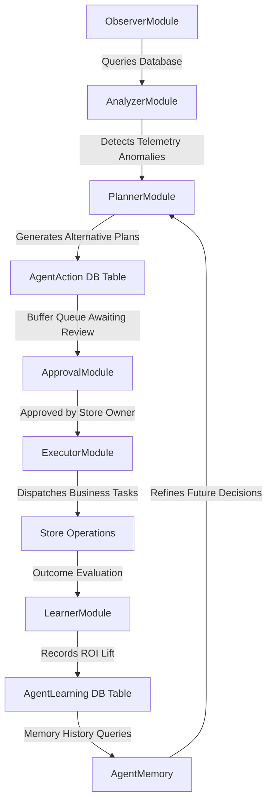

# JourneyIQ Autonomous Agentic AI System (v1.3)

JourneyIQ implements a complete, closed-loop **Autonomous Agentic AI** orchestration engine that operates over live database records to manage storefront operations, marketing promotions, stock replenishment, and ML performance optimization with safety-critical human-in-the-loop approvals.

---

## 🏗️ System Architecture

The agent architecture follows a strict, single-responsibility stage execution model:

### 1. Perception & Telemetry: `Observer` (`observer.py`)
Queries live e-commerce databases dynamically to extract:
* **Inventory Stock**: Low stock products and out of stock levels.
* **Order Sales**: Sum of confirmations, pending queues, and day-over-day revenue drop calculations.
* **Events Funnel**: AI Chat usage volumes, product clicks, page views, search trend terms, and average session lengths.
* **Payment Failure Rates**: Ratio of failed checkout transaction completions.
* **NCF Metrics**: Dynamic retrieval of PyTorch model precision and NDCG values.

### 2. Diagnosis & Priority Grading: `Analyzer` (`analyzer.py`)
Classifies telemetry state variables into diagnostic business issues:
* **Critical**:
  - `REVENUE_DROP` (revenue drop >= 20%)
  - `OUT_OF_STOCK` (any active product stock == 0)
  - `PAYMENT_FAILURE` (failed payments > 10% of total today)
* **High**:
  - `LOW_STOCK` (any product stock < 5)
  - `DECLINING_SENTIMENT` (positive review percentage < 70%)
* **Medium**:
  - `CART_ABANDONMENT` (inactive carts >= 5)
* **Low**:
  - `SLOW_PRODUCT` (active product with 0 sales in 7 days)
  - `MODEL_DEGRADATION` (precision_at_10 < 0.05)

### 3. Alternative Generation: `Planner` (`planner.py`)
Converts diagnosed issues into multiple recommended plan alternatives, saved as `PENDING` states in the `AgentAction` model.
For example, for a `REVENUE_DROP` issue, it proposes:
1. **Flash Sale Coupon** (`COUPON` action type)
2. **Targeted Social Ad Campaign** (`AD_CAMPAIGN` action type)
3. **Promotional Newsletter Blast** (`EMAIL_CAMPAIGN` action type)

### 4. Safety Guardrails: `Approval` (`approval.py`)
Requires store owner approval to run marketing coupons, notifications, or outreach. 
* Approving a plan automatically marks it as `APPROVED`, triggers the `Executor`, and marks all alternative options generated for the same issue ID as `REJECTED`.
* Approvals/rejections are logged in the `AuditLog` table.

### 5. Task Orchestration: `Executor` (`executor.py`)
Performs the actions in the database when approved:
* `RESTOCK`: Logs supplier purchase requests and replenishes database stock counts.
* `COUPON`: Dynamically inserts active coupon codes in the system catalog.
* `RETRAIN_MODEL`: Launches PyTorch recommendations NCF training pipelines.
* Saves execution start time, end time, latency (ms), retries, and errors to the database.

### 6. Dynamic Learner: `Learner` (`learner.py`)
Compares storefront KPIs in the 24 hours before vs. 24 hours after execution. Registers outcomes in the `AgentLearning` model, calculating conversion lift, ROI, and recovered revenue.

### 7. Core Memory: `Memory` (`memory.py`)
Maintains historical statistics on completed decisions, average execution times, common issues, and failure rates to guide subsequent agent operations.

---

## 🔄 Scheduled Run Loops
The system schedules loop executions using `APScheduler`. The background scheduler starts during the FastAPI startup lifespan event (registered in `app/main.py`) and executes `Observer -> Analyzer -> Planner` at configurable intervals (default: 5 minutes) without blocking FastAPI worker threads.

---

## 📡 REST API Documentation

### 1. `GET /api/v1/agent/status`
* **Description**: Gathers real e-commerce metrics, current active plans, pending approvals, and historical logs.
* **Response**: Standard generic `APIResponse` envelope containing the state.

### 2. `GET /api/v1/agent/actions`
* **Description**: Retrieves the complete list of proposed and active agent actions in the database.

### 3. `GET /api/v1/agent/logs`
* **Description**: Returns timeline logs of completed, failed, and rejected decisions.

### 4. `GET /api/v1/agent/learning`
* **Description**: Retrieves performance ROI evaluation histories from table logs.

### 5. `POST /api/v1/agent/actions/{id}/approve`
* **Description**: Approves a proposed agent action, trigger execution, evaluate outcomes, and reject alternatives.

### 6. `POST /api/v1/agent/actions/{id}/reject`
* **Description**: Rejects a proposed agent action.

### 7. `POST /api/v1/agent/run`
* **Description**: Forces an on-demand, manual run of the Agent perception-reasoning-planning loop.
