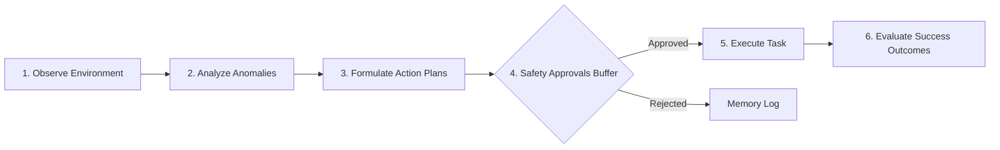

# JourneyIQ Agentic AI Architecture (v1.2)

JourneyIQ v1.2 integrates an autonomous Agentic AI customer journey orchestrator to monitor storefront logs and recommend marketing/restock actions.

---

## 1. Agent Architecture Flow Diagram

---

## 2. Agent Execution Loop Stages

### 1. Observe (Perception)
Queries db telemetry looking for critical state signals:
- Stockout items (stock <= 5).
- Funnel checkout drop-off anomalies.
- Customer sentiment trends (average review rating).

### 2. Analyze (Reasoning)
Flags system anomalies and documents plain-language explanations:
- *Cart Abandonment > 35%* → Triggers "High Cart Abandonment" reasoning card.

### 3. Plan (Planning)
Formulates structured marketing campaigns or operational suggestions.

### 4. Safety Approvals Buffer (Human-in-the-Loop)
**Strict Security Constraint:** Sensitive actions (dispatches, price modifications, discount generation) MUST reside in a pending queue until approved by a store owner.

### 5. Execute (Execution)
Triggers actions post-approval and logs execution telemetry (timestamps, executor user).

### 6. Learn (Evaluation)
Compares performance lifts (conversion lift, recovered checkout sales) to guide future planning stages.
