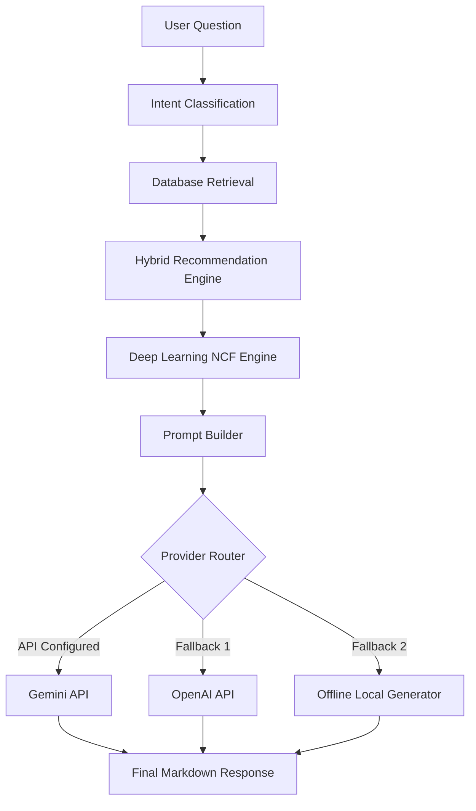

# JourneyIQ AI Shopping Assistant Architecture

This document describes the design, prompts flow, and pipeline components of the Conversational AI Shopping Assistant in JourneyIQ v1.1.

---

## 1. Retrieval Pipeline Flow Chart

---

## 2. Supported Conversation Intents

*   `recommend_product`: Standard product recommendation queries (e.g. "Recommend a water bottle").
*   `compare_products`: Product comparisons (e.g. "Compare Hydro Flask and thermal flask").
*   `price_filter`: Queries specifying a budget threshold (e.g. "Show products under $30").
*   `trending_products`: Top-selling and popular filters.
*   `wishlist_based`: Queries referencing saved items.
*   `recommend_for_me`: Personalized recommendation outputs fed from the Hybrid/Deep learning pipeline.
*   `order_status`: Customer order delivery checks.
*   `general_qna`: Default chatbot conversational fallback.

---

## 3. Session Context Memory

To maintain state without permanent storage bottlenecks, the assistant uses an in-process memory mapper tracking:
- User budget limit detections.
- Preferred product categories identified during the active session.
- Preceding conversation queries.
- Current active cart and wishlist counts.

Memory is cleared automatically upon session expiration.
