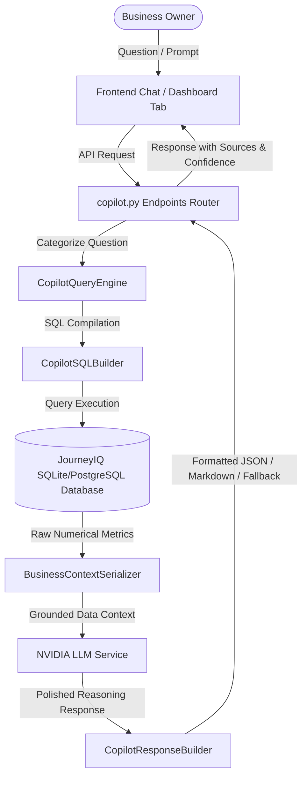

# JourneyIQ AI Business Copilot System Documentation (v1.4)

JourneyIQ's AI Business Copilot is an enterprise-grade retail intelligence dashboard designed to give store owners real-time, explainable, and actionable insights about their operations. It combines live database queries, statistical risk profiling, custom report templates, and LLM reasoning to explain complex retail trends without the risk of data hallucinations.

---

## 1. Architectural Overview

The AI Business Copilot is built as an extension of the JourneyIQ dashboard, reusing the system's core database models, analytical layers, and machine learning components (Neural Collaborative Filtering (NCF) for recommendations, NLP sentiment analysis for customer satisfaction, and Agentic AI workflow metrics).

---

## 2. Preventing Hallucinations (Data Grounding)

Enterprise systems must never hallucinate core business metrics (e.g., revenue, order volume, satisfaction scores, or stock levels). JourneyIQ guarantees absolute numerical accuracy by enforcing a strict separation of concerns:

1. **Database as the Sole Source of Truth**: The LLM is **never** asked to calculate, aggregate, or guess any numbers. All quantitative metrics are retrieved directly from the database using raw SQL queries compiled by the `CopilotSQLBuilder`.
2. **System Grounding & Prompt Serialization**: Retrieved numbers are structured into a deterministic text context by the `BusinessContextSerializer`. This context is injected into the LLM system prompt:
   - "You are a Business Copilot. Below is the exact live data from the database. You must answer the user's question using only this data. Do not make up any numbers, dates, or calculations."
3. **Deterministic Fallbacks**: If the NVIDIA LLM service is offline or invalid API keys are configured, the system uses the `CopilotResponseBuilder` fallback engine. It generates rule-based analytical text incorporating live database metrics to ensure the system is always operational and correct.

---

## 3. Query Engine & Retail Intent Routing

The `CopilotQueryEngine` parses natural language queries and routes them to one of five retail intents:

| Intent | Sample Questions | Trigger Words / Patterns | Database Sources |
| :--- | :--- | :--- | :--- |
| `REVENUE_DROP` | "Why did sales decrease?", "Explain revenue decline" | sales drop, revenue decrease, revenue down, drop in sales | `Order`, `Payment` |
| `INVENTORY_RESTOCK` | "What needs restocking?", "Show low stock products" | restock, low stock, out of stock, inventory health | `Product`, `Category` |
| `CUSTOMER_SATISFACTION` | "Are customers happy?", "How is CSAT?" | csat, satisfaction, customer feedback, sentiment, reviews | `Review`, `User` |
| `CHECKOUT_ABANDONMENT` | "Where are users dropping off?", "Why is cart abandonment high?" | drop off, cart abandonment, checkout funnel, basket drop | `Cart`, `Wishlist` |
| `GENERAL_SUMMARY` | "How is my business doing?", "Give me an overview" | summary, status, overview, performance, how is business | All tables |

If no specific pattern matches, the query defaults to a general diagnostic summary combining key metrics across all areas.

---

## 4. Business Risk Evaluation Index

To give owners an immediate understanding of their operational health, the `CopilotInsightEngine` calculates a global **Business Risk Index** ranging from `0` (no issues) to `100` (critical risk).

### Formula
$$RiskIndex = w_1 \cdot R_{inventory} + w_2 \cdot R_{revenue} + w_3 \cdot R_{sentiment} + w_4 \cdot R_{funnel}$$

Where:
- $w_1 = 0.35$ (Inventory Weight)
- $w_2 = 0.30$ (Revenue Decline Weight)
- $w_3 = 0.20$ (CSAT / Sentiment Decline Weight)
- $w_4 = 0.15$ (Cart Abandonment Weight)

### Risk Metrics Computation
- **Inventory Risk ($R_{inventory}$)**: Percentage of product catalog with stock $\le$ reorder threshold (default: 5 units).
- **Revenue Risk ($R_{revenue}$)**: Week-over-week revenue decrease percentage. If revenue increased, risk contribution is `0`.
- **Sentiment Risk ($R_{sentiment}$)**: Percentage of reviews with a negative sentiment score (score $\le$ 2.0).
- **Funnel Risk ($R_{funnel}$)**: Abandonment rate calculation:
  $$AbandonmentRate = 1.0 - \frac{\text{Completed Orders}}{\max(\text{Active Carts}, 1)}$$

---

## 5. Executive Reports & Formatting Engine

The `CopilotReportGenerator` compiles daily, weekly, and monthly operational briefs.

### Format Types
- **Markdown (`.md`)**: Highly structured text using Github Flavored Markdown (GFM) tables, sub-bullet metrics, and blockquotes suitable for chat rendering or internal documentation.
- **JSON (`.json`)**: Raw numerical schemas for external integrations or automated dashboards.
- **HTML/Print Preview**: High-fidelity CSS styled report template using the project's brand colors (slate, dark modes, crisp borders) optimize-designed for browser printing (PDF export).

### Report Sections
1. **Header**: Timestamp, Report Type (Daily/Weekly/Monthly), and Status.
2. **Executive Sales Summary**: Revenue, Order Counts, Average Order Value (AOV).
3. **Inventory Status**: Total active products, count of low-stock items, out-of-stock count.
4. **Customer Health & Sentiment**: Average rating, positive vs negative review counts.
5. **Operational Risks**: Bullet list of items scoring high risk in the anomaly engine.
6. **Suggested Actions**: Dynamic recommendations based on the system's Agentic actions (e.g., restock proposals, promo coupon campaigns).

---

## 6. Frontend Integration & Explanations

The workspace tab is registered in `Dashboard.tsx` and loads `BusinessCopilot.tsx`.

### UI Highlights
- **KPI Cards Grid**: Renders live KPIs (Revenue, CSAT, Inventory Health, Risk Index).
- **Explainable AI Metadata**: Under every chat message response, the dashboard renders:
  - **Sources**: Chip buttons listing the tables used (e.g., `Orders`, `Reviews`).
  - **Confidence**: Progress bar showing metric reliability.
  - **Reasoning**: Accordion list of steps taken to formulate the answer.
  - **Follow-up Prompts**: Clickable question chips that automatically submit to the chat.
- **Drill-down Navigation**: Clicking on recommendations or issues automatically routes the owner to the relevant tab (e.g., clicking a stock recommendation takes the user to the Products tab; clicking a campaign recommendation takes the user to the Agentic AI execution log).
