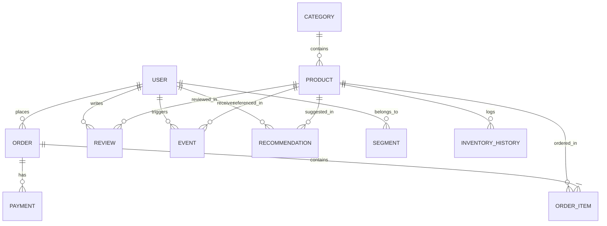

# JourneyIQ Database Architecture Guide

This guide documents the production-ready database layer implemented in **Phase 2** for **JourneyIQ – Personalized Customer Journey Optimization Platform**.

---

## 1. Entity-Relationship (ER) Diagram

The following Mermaid diagram outlines the relationships among the 11 database tables:

---

## 2. Database Schema & Tables Description

### Common Base Properties
All tables inherit from `BaseModel` which automatically injects:
*   `id`: `INTEGER` Primary Key (auto-incrementing).
*   `created_at`: `TIMESTAMP WITH TIME ZONE` (server-default `func.now()`).
*   `updated_at`: `TIMESTAMP WITH TIME ZONE` (auto-updates on modification).

`User`, `Category`, and `Product` tables also inherit from `SoftDeleteMixin`:
*   `is_deleted`: `BOOLEAN` (default `FALSE`).
*   `deleted_at`: `TIMESTAMP WITH TIME ZONE` (nullable, set when soft-deleted).

---

### Tables Schema Specifications

#### 1. `User` (Table Name: `user`)
Tracks application users and customers.
*   `full_name`: `VARCHAR(100)` (non-nullable).
*   `email`: `VARCHAR(255)` (unique, indexed, non-nullable).
*   `password_hash`: `VARCHAR(255)` (non-nullable).
*   `phone`: `VARCHAR(20)` (nullable).
*   `role`: `VARCHAR(50)` (default `"customer"`, non-nullable).
*   `is_active`: `BOOLEAN` (default `TRUE`, non-nullable).

#### 2. `Category` (Table Name: `category`)
Groups products into retail departments.
*   `name`: `VARCHAR(100)` (non-nullable).
*   `slug`: `VARCHAR(120)` (unique, indexed, non-nullable).
*   `description`: `TEXT` (nullable).

#### 3. `Product` (Table Name: `product`)
Stores catalog product details.
*   `category_id`: `INTEGER` (foreign key to `category.id`, on delete `RESTRICT`, non-nullable).
*   `name`: `VARCHAR(150)` (non-nullable).
*   `slug`: `VARCHAR(180)` (unique, indexed, non-nullable).
*   `description`: `TEXT` (nullable).
*   `brand`: `VARCHAR(100)` (nullable).
*   `image_url`: `VARCHAR(255)` (nullable).
*   `price`: `NUMERIC(10, 2)` (non-nullable).
*   `stock`: `INTEGER` (non-nullable).
*   `is_active`: `BOOLEAN` (default `TRUE`, non-nullable).
*   **Constraints**:
    *   `price >= 0` (`check_product_price_non_negative`)
    *   `stock >= 0` (`check_product_stock_non_negative`)

#### 4. `InventoryHistory` (Table Name: `inventoryhistory`)
A ledger tracking all changes to stock levels.
*   `product_id`: `INTEGER` (foreign key to `product.id`, on delete `CASCADE`, non-nullable).
*   `old_stock`: `INTEGER` (non-nullable).
*   `new_stock`: `INTEGER` (non-nullable).
*   `reason`: `VARCHAR(255)` (non-nullable).
*   **Constraints**:
    *   `old_stock >= 0` (`check_inventory_old_stock_non_negative`)
    *   `new_stock >= 0` (`check_inventory_new_stock_non_negative`)

#### 5. `Order` (Table Name: `order`)
Stores checkout receipt aggregates.
*   `user_id`: `INTEGER` (foreign key to `user.id`, on delete `RESTRICT`, non-nullable).
*   `status`: `VARCHAR(50)` (default `"pending"`, non-nullable).
*   `subtotal`: `NUMERIC(10, 2)` (non-nullable).
*   `tax`: `NUMERIC(10, 2)` (non-nullable).
*   `discount`: `NUMERIC(10, 2)` (non-nullable).
*   `total`: `NUMERIC(10, 2)` (non-nullable).
*   **Constraints**:
    *   `subtotal >= 0` (`check_order_subtotal_non_negative`)
    *   `tax >= 0` (`check_order_tax_non_negative`)
    *   `discount >= 0` (`check_order_discount_non_negative`)
    *   `total >= 0` (`check_order_total_non_negative`)

#### 6. `OrderItem` (Table Name: `orderitem`)
Maps purchased products to orders.
*   `order_id`: `INTEGER` (foreign key to `order.id`, on delete `CASCADE`, non-nullable).
*   `product_id`: `INTEGER` (foreign key to `product.id`, on delete `RESTRICT`, non-nullable).
*   `quantity`: `INTEGER` (default `1`, non-nullable).
*   `unit_price`: `NUMERIC(10, 2)` (non-nullable).
*   `subtotal`: `NUMERIC(10, 2)` (non-nullable).
*   **Constraints**:
    *   `quantity > 0` (`check_order_item_quantity_positive`)
    *   `unit_price >= 0` (`check_order_item_unit_price_non_negative`)
    *   `subtotal >= 0` (`check_order_item_subtotal_non_negative`)

#### 7. `Review` (Table Name: `review`)
Contains user ratings for products.
*   `user_id`: `INTEGER` (foreign key to `user.id`, on delete `CASCADE`, non-nullable).
*   `product_id`: `INTEGER` (foreign key to `product.id`, on delete `CASCADE`, non-nullable).
*   `rating`: `INTEGER` (non-nullable).
*   `review`: `TEXT` (nullable).
*   **Constraints**:
    *   `rating >= 1 AND rating <= 5` (`check_review_rating_1_to_5`)

#### 8. `Event` (Table Name: `event`)
Customer interaction log (page views, checkout items) supporting marketing intelligence.
*   `user_id`: `INTEGER` (foreign key to `user.id`, on delete `SET NULL`, nullable).
*   `session_id`: `UUID` (non-nullable).
*   `event_type`: `VARCHAR(50)` (non-nullable).
*   `page`: `VARCHAR(255)` (nullable).
*   `product_id`: `INTEGER` (foreign key to `product.id`, on delete `SET NULL`, nullable).
*   `metadata`: `JSON` (nullable).
*   `timestamp`: `TIMESTAMP WITH TIME ZONE` (server-default `func.now()`, non-nullable).

#### 9. `Recommendation` (Table Name: `recommendation`)
Calculated personalization score for catalog items.
*   `user_id`: `INTEGER` (foreign key to `user.id`, on delete `CASCADE`, non-nullable).
*   `product_id`: `INTEGER` (foreign key to `product.id`, on delete `CASCADE`, non-nullable).
*   `score`: `DOUBLE PRECISION` (non-nullable).
*   `generated_at`: `TIMESTAMP WITH TIME ZONE` (server-default `func.now()`, non-nullable).

#### 10. `Segment` (Table Name: `segment`)
User cohort categorization flags (e.g. "VIP", "Churn Risk").
*   `user_id`: `INTEGER` (foreign key to `user.id`, on delete `CASCADE`, non-nullable).
*   `segment_name`: `VARCHAR(100)` (non-nullable).
*   `confidence`: `DOUBLE PRECISION` (non-nullable).

#### 11. `Payment` (Table Name: `payment`)
Transaction details linked to orders.
*   `order_id`: `INTEGER` (foreign key to `order.id`, on delete `CASCADE`, non-nullable).
*   `payment_provider`: `VARCHAR(50)` (non-nullable).
*   `payment_id`: `VARCHAR(100)` (nullable).
*   `status`: `VARCHAR(50)` (non-nullable).
*   `amount`: `NUMERIC(10, 2)` (non-nullable).
*   `currency`: `VARCHAR(10)` (default `"USD"`, non-nullable).
*   **Constraints**:
    *   `amount >= 0` (`check_payment_amount_non_negative`)

---

## 3. Indexing Strategies

Custom indexes are implemented to accelerate core retail querying workloads:
1.  **Unique Natural Keys**: Indexes on `user.email`, `category.slug`, and `product.slug` allow O(1) lookups and enforce logical uniqueness.
2.  **Foreign Key Optimization**: Foreign keys (`product.category_id`, `order.user_id`, `orderitem.order_id`, `orderitem.product_id`, `review.user_id`, `review.product_id`, `payment.order_id`, `recommendation.user_id`, `recommendation.product_id`, `segment.user_id`) are explicitly indexed to guarantee fast join resolution.
3.  **Customer Session Trackers**: `event.session_id` and `event.event_type` are indexed for session-based event analytics.
4.  **Chronological Cohort Analysis**: A composite index `idx_event_user_timestamp` on `(user_id, timestamp)` allows fast sorting and range searches on chronological event flows per customer.

---

## 4. Faker Seeding Dataset Scope

Executing `python seed.py` populates the live Supabase PostgreSQL database with the following demo records:
*   **Users**: 100 entries (10% marked as `is_deleted=True`, 10% marked as `is_active=False`).
*   **Categories**: 15 entries (2 marked as `is_deleted=True`).
*   **Products**: 100 entries (10% marked as `is_deleted=True`, associated with categories).
*   **InventoryHistory**: 100 initial receipts + 300 order deduction updates (minimum 400 entries total).
*   **Orders**: 300 entries (various statuses: pending, completed, shipped, cancelled).
*   **OrderItem**: 1 to 4 items per order (average ~750 items total, deducting stock from products).
*   **Payments**: 1 transaction entry per order (except cancelled orders, which have a 20% mock checkout probability).
*   **Reviews**: 500 product feedback reviews (ratings 1 to 5 stars).
*   **Recommendations**: 5 personalized recommended products per active user (450 entries total).
*   **Segments**: VIP, High Value, Window Shopper, Frequent Buyer, or Churn Risk assignments for 85% of active users.
*   **Events**: 1000 page navigation / view product events (using 120 unique session UUIDs, 30% mock anonymous tracking).

---

## 5. Read-Only REST API Endpoints

All list endpoints are exposed under `/api/v1/` and filter out soft-deleted items:

### 1. Products List
*   **URL**: `GET /api/v1/products`
*   **Filters**:
    *   `search` (string): Match product name, brand, or description.
    *   `category_id` (int): Filter by Category ID.
    *   `brand` (string): Filter by brand.
    *   `price_min` / `price_max` (decimal): Range bounds for pricing.
    *   `in_stock` (bool): Filter items in stock (`true`) or out of stock (`false`).
*   **Sorting**:
    *   `sort_by` (string): Option to sort by `price`, `stock`, or `created_at`.
    *   `sort_order` (string): `asc` or `desc`.

### 2. Categories List
*   **URL**: `GET /api/v1/categories`
*   **Filters**:
    *   `search` (string): Match category name.

### 3. Users List
*   **URL**: `GET /api/v1/users`
*   **Filters**:
    *   `search` (string): Match name or email.
    *   `role` (string): Filter by role (`admin`, `customer`, etc.).
    *   `is_active` (bool): Filter active/inactive users.

### 4. Orders List
*   **URL**: `GET /api/v1/orders`
*   **Filters**:
    *   `user_id` (int): Get orders for a specific customer.
    *   `status` (string): Filter by checkout status.
    *   `total_min` (decimal): Filter orders above a minimum total.
*   **Optimizations**: Automatically eager-loads nested `order_items` via SQLAlchemy's `selectinload` strategy.

### 5. Events List
*   **URL**: `GET /api/v1/events`
*   **Filters**:
    *   `user_id` (int): Filter by customer ID.
    *   `session_id` (uuid): Filter by session UUID.
    *   `event_type` (string): Filter by tracking types (`page_view`, `view_item`, etc.).
