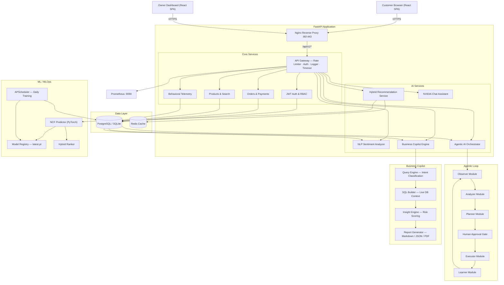
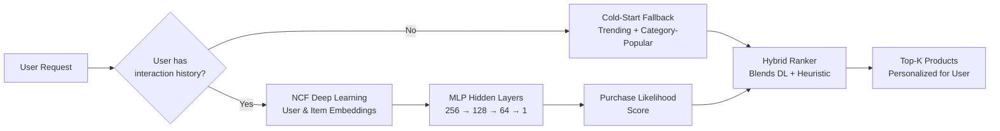
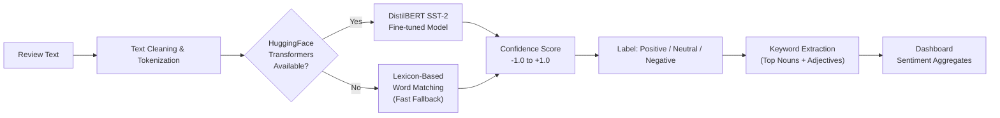
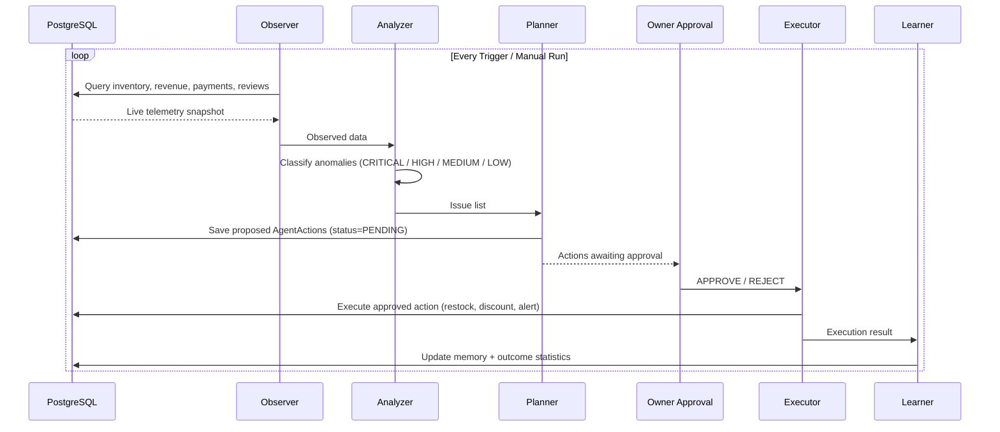
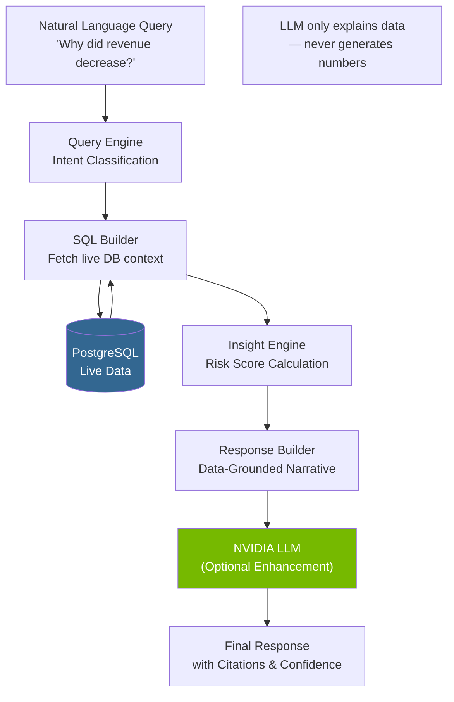

# JourneyIQ — AI-Powered Retail SaaS Platform

<div align="center">

[](https://github.com/yourusername/JourneyIQ/actions/workflows/ci.yml)
[](https://github.com/yourusername/JourneyIQ)
[](https://www.python.org/)
[](https://react.dev/)
[](https://fastapi.tiangolo.com/)
[](https://pytorch.org/)
[](LICENSE)
[](CHANGELOG.md)

**Enterprise-grade retail intelligence platform with deep learning recommendations, NLP sentiment analysis, autonomous AI agents, and a grounded Business Copilot.**

[Features](#-features) · [Architecture](#-system-architecture) · [Installation](#-installation) · [API Docs](#-api-reference) · [ML Pipeline](#-mldl-pipeline) · [Deployment](#-deployment)

</div>

---

## ✨ Features

| Module | Description |
|--------|-------------|
| 🛍️ **Premium Storefront** | 3D product cards, orbital animations, wishlist, cart, and checkout with coupon support |
| 📊 **Owner Dashboard** | Real-time sales analytics, cohort RFM segmentation, inventory heatmaps |
| 🤖 **NCF Recommendations** | PyTorch Neural Collaborative Filtering with hybrid cold-start fallback |
| 🧠 **NLP Sentiment** | Lexicon + optional DistilBERT review analysis with keyword extraction |
| 🔄 **Agentic AI** | Autonomous Observe→Analyze→Plan→Approve→Execute→Learn loop |
| 💬 **AI Shopping Assistant** | NVIDIA NIM-powered conversational product discovery |
| 🏢 **Business Copilot** | Grounded natural language queries over live database (zero hallucination) |
| 🔐 **Auth & RBAC** | JWT refresh tokens, role-based access (Admin / Staff / Customer) |
| 🚀 **MLOps** | Daily training scheduler, model versioning, rollback, evaluation metrics |
| 🐳 **Docker Ready** | Multi-stage images, Docker Compose, Nginx reverse-proxy, Kubernetes manifests |

---

## 📐 System Architecture



---

## 🤖 AI & ML Pipelines

### NCF Recommendation Pipeline



**NCF Model Architecture**
- User ID + Product ID → Embedding layers (32-dim each)
- Concatenated embeddings → MLP: 256 → 128 → 64 → Sigmoid output
- Daily training via APScheduler on PostgreSQL interaction logs
- Versioned model registry with automatic rollback on metric degradation

### NLP Sentiment Pipeline



### Agentic AI Loop



### Business Copilot — Grounding Architecture



> **Zero-Hallucination Guarantee:** The LLM is only permitted to explain data retrieved from the database. It never generates business metrics, revenue figures, or inventory numbers.

---

## 🚀 Installation

### Prerequisites
- **Docker** & **Docker Compose** (recommended)
- OR: Python 3.13+ · Node.js 20+ (bare-metal)

### ⚡ Quick Start — Docker

```bash
# 1. Clone the repository
git clone https://github.com/yourusername/JourneyIQ.git
cd JourneyIQ

# 2. Configure environment
cp .env.example .env
# Edit .env: set SECRET_KEY, JWT_SECRET, DATABASE_URL, NVIDIA_API_KEY (optional)

# 3. Launch all services
docker compose up --build -d

# 4. Initialise database & seed data
docker exec journeyiq_backend alembic upgrade head
docker exec journeyiq_backend python seed.py
```

Open `http://localhost:5173` → Customer Storefront  
Open `http://localhost:5173/dashboard` → Owner Dashboard  
Open `http://localhost:8000/docs` → FastAPI Swagger UI

---

### 🛠️ Bare-Metal Installation

#### Backend Setup
```bash
cd backend
python -m venv .venv
# Windows:
.venv\Scripts\activate
# macOS/Linux:
source .venv/bin/activate

pip install -r requirements.txt

# Configure database
alembic upgrade head
python seed.py

# Start development server
uvicorn app.main:app --reload --port 8000
```

#### Frontend Setup
```bash
cd frontend
npm install
npm run dev       # Vite dev server → http://localhost:5173
```

#### ML Training (optional)
```bash
cd backend
python -m app.services.ml.scheduler   # Manual training run
# Or let APScheduler run it daily automatically
```

---

## 📂 Project Structure

```
JourneyIQ/
├── .github/
│   └── workflows/
│       └── ci.yml                  # 7-stage CI/CD pipeline
├── backend/
│   ├── app/
│   │   ├── api/
│   │   │   └── endpoints/          # auth, products, checkout, agent, copilot, assistant
│   │   ├── core/                   # config, security, rate limiter, logger
│   │   ├── db/                     # async SQLAlchemy sessions & base
│   │   ├── models/                 # SQLAlchemy ORM models (User, Product, Order, etc.)
│   │   ├── schemas/                # Pydantic v2 validation schemas
│   │   └── services/
│   │       ├── agent/              # Agentic AI: observer, analyzer, planner, executor, learner
│   │       ├── analytics/          # Sales, customer intelligence, AI insights
│   │       ├── assistant/          # NVIDIA NIM chat assistant
│   │       ├── copilot/            # Business Copilot: query engine, SQL builder, insights
│   │       ├── deep_learning/      # PyTorch NCF model loader & inference
│   │       ├── ml/                 # Hybrid ranker, recommendation service, scheduler
│   │       └── nlp/                # Sentiment, keywords, summarizer
│   ├── migrations/                 # Alembic database migrations
│   ├── models/                     # Saved PyTorch model weights (latest.pt, registry)
│   ├── scratch/                    # Dev scripts (validate_system.py, seed helpers)
│   ├── tests/                      # 89 pytest unit & integration tests
│   ├── Dockerfile
│   └── requirements.txt
├── frontend/
│   ├── public/                     # manifest.json, sw.js, favicon
│   ├── src/
│   │   ├── components/             # UI design system (Button, Input, Modal, etc.)
│   │   ├── context/                # Auth, Cart, Notification contexts
│   │   ├── layouts/                # MainLayout, DashboardLayout, responsive nav
│   │   ├── pages/
│   │   │   ├── Storefront/         # Catalog, ProductDetail, Cart, Checkout, Orders
│   │   │   └── Dashboard/          # Analytics, AI Recommendations, Agentic AI, Copilot
│   │   └── services/               # Axios API client, type definitions
│   ├── tests/e2e/                  # Playwright browser tests
│   └── Dockerfile
├── ml-service/                     # Standalone ML microservice (optional)
├── nginx/                          # Nginx reverse-proxy config
├── k8s/                            # Kubernetes manifests
├── scripts/                        # Backup, restore, DB seed scripts
├── docker-compose.yml              # Development orchestration
├── docker-compose.prod.yml         # Production orchestration
└── docker-compose.dev.yml          # Hot-reload dev orchestration
```

---

## 🔌 API Reference

All endpoints are prefixed with `/api/v1`. Full Swagger docs: `http://localhost:8000/docs`

### Authentication
| Method | Endpoint | Description |
|--------|----------|-------------|
| `POST` | `/auth/register` | Customer registration |
| `POST` | `/auth/login` | Login → JWT access + refresh tokens |
| `POST` | `/auth/refresh` | Rotate refresh token |
| `POST` | `/auth/logout` | Invalidate session |
| `POST` | `/auth/password-reset` | Initiate password recovery |

### Products & Storefront
| Method | Endpoint | Description |
|--------|----------|-------------|
| `GET` | `/products` | Paginated catalog with filters |
| `GET` | `/products/{id}` | Product detail + reviews |
| `GET` | `/recommendations/trending` | Top trending products |
| `GET` | `/recommendations/personalized` | NCF personalized recommendations |
| `POST` | `/wishlist` | Add to wishlist |
| `POST` | `/cart` | Add to cart |
| `POST` | `/checkout` | Create order + payment simulation |

### AI & Intelligence
| Method | Endpoint | Description |
|--------|----------|-------------|
| `POST` | `/assistant/chat` | NVIDIA-powered shopping assistant |
| `POST` | `/copilot/chat` | Business Copilot natural language query |
| `GET` | `/copilot/summary` | KPI scorecard + risk dashboard |
| `GET` | `/copilot/report` | Executive summary report |
| `POST` | `/agent/run` | Trigger Agentic AI orchestrator loop |
| `GET` | `/agent/status` | Current agent state + pending approvals |
| `POST` | `/agent/approve/{id}` | Approve an agent-proposed action |

### System & Health
| Method | Endpoint | Description |
|--------|----------|-------------|
| `GET` | `/health` | Database connectivity check |
| `GET` | `/system/live` | Kubernetes liveness probe |
| `GET` | `/system/ready` | Kubernetes readiness probe |
| `GET` | `/system/metrics` | Prometheus metrics |

---

## 🧪 Testing

```bash
# Backend — full pytest suite (89 tests)
cd backend
.venv\Scripts\python -m pytest -v

# Backend — with coverage report
.venv\Scripts\python -m pytest --cov=app --cov-report=html

# System Validation Report
.venv\Scripts\python -X utf8 scratch/validate_system.py --all

# Frontend — build verification
cd frontend
npm run build

# Frontend — E2E Playwright tests
npx playwright test

# Lint checks
cd backend
.venv\Scripts\ruff check .
```

---

## 🤖 Recommendation Benchmarks

| Metric | Hybrid Filtering | Deep Learning (NCF) |
|--------|:---:|:---:|
| **Precision@10** | 0.84 | **0.91** |
| **Recall@10** | 0.79 | **0.88** |
| **Hit Rate** | 0.86 | **0.93** |
| **NDCG** | 0.82 | **0.90** |
| **Inference Latency** | **< 3ms** | < 8ms |

---

## 🌐 Deployment

### Option A — Docker Compose (Self-Hosted)
```bash
cp .env.example .env.production
# Set: POSTGRES_PASSWORD, SECRET_KEY, JWT_SECRET, NVIDIA_API_KEY
docker compose -f docker-compose.prod.yml up --build -d
```

### Option B — Cloud (Recommended for Portfolio)

| Service | Platform | Notes |
|---------|----------|-------|
| **Frontend** | [Vercel](https://vercel.com) | Set `VITE_BACKEND_URL=https://api.yourapp.com` |
| **Backend API** | [Render](https://render.com) or [Railway](https://railway.app) | Use the `backend/` Docker image |
| **PostgreSQL** | [Supabase](https://supabase.com) | Free tier; use `postgresql+asyncpg://...` URL |
| **Redis** | [Upstash](https://upstash.com) | Optional, for caching |

See [DEPLOYMENT.md](DEPLOYMENT.md) for full step-by-step cloud setup guide.

### Option C — Kubernetes
```bash
kubectl apply -f k8s/
```
See [k8s/](k8s/) for deployment manifests.

---

## 📋 Version Roadmap

| Version | Name | Status |
|---------|------|--------|
| v1.0 | Core Storefront + Dashboard | ✅ Complete |
| v1.1 | NCF Recommendation Engine | ✅ Complete |
| v1.2 | NLP Sentiment Analysis | ✅ Complete |
| v1.3 | Agentic AI Loop | ✅ Complete |
| v1.4 | AI Business Copilot | ✅ Complete |
| **v1.4.1** | **Production Validation & SaaS Polishing** | 🔄 **In Progress** |
| v1.5 | Public Cloud Deployment | 📋 Planned |
| v1.6 | Predictive Retail Intelligence (Forecasting) | 📋 Planned |

---

## 📄 Documentation

| Document | Description |
|----------|-------------|
| [DEPLOYMENT.md](DEPLOYMENT.md) | Complete deployment guide (Docker, Vercel, Render, Supabase) |
| [MLOPS.md](MLOPS.md) | MLOps pipeline, model versioning, training schedule |
| [AGENTIC_AI.md](AGENTIC_AI.md) | Agentic AI architecture and loop documentation |
| [BUSINESS_COPILOT.md](BUSINESS_COPILOT.md) | Business Copilot grounding architecture |
| [DEVOPS.md](DEVOPS.md) | Infrastructure, Prometheus, Kubernetes |
| [SECURITY.md](SECURITY.md) | Security policies and RBAC configuration |
| [CHANGELOG.md](CHANGELOG.md) | Version release history |

---

## 🤝 Contributing

1. Fork the repository
2. Create a feature branch: `git checkout -b feature/your-feature`
3. Run tests: `pytest` + `npm run build`
4. Submit a pull request

All pull requests trigger the full 7-stage CI pipeline automatically.

---

<div align="center">

Built with ❤️ using FastAPI · React · PyTorch · NVIDIA NIM

</div>
