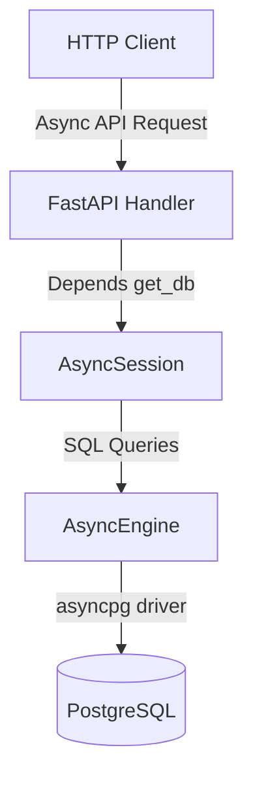
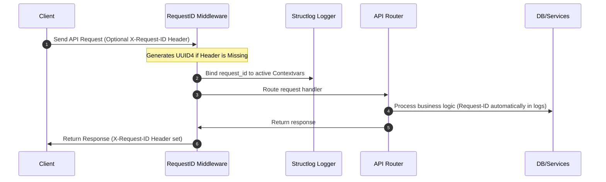

# JourneyIQ Platform Architecture (Phase 1)

This document provides a detailed overview of the core architectural patterns and design decisions implemented in Phase 1 of JourneyIQ.

---

## 1. Asynchronous Database Pipeline

To maximize throughput and scalability for high-frequency user tracking events, Phase 1 utilizes an fully asynchronous database connection flow.



### Key Configurations:
- **`asyncpg`**: An asynchronous PostgreSQL driver that delivers superior speed compared to traditional synchronous drivers (`psycopg2`).
- **Connection Pool**: Engineered using `create_async_engine` with parameters:
  - `pool_pre_ping=True` (active connection testing)
  - `pool_size=20` (baseline pool)
  - `max_overflow=10` (surge capability)

---

## 2. Request Traceability (Request-ID Flow)

To simplify production debugging and trace individual user actions, every HTTP request flows through a unique identification lifecycle.



### Advantages:
- **Correlation**: In microservices or cluster deployments, you can search for a single `request_id` across all containers to compile a complete trace of any issue.
- **Client-Side Awareness**: Frontend applications receive the `X-Request-ID` header, enabling them to display it in error banners for users to report.

---

## 3. Global Exception Handling and Standardized Error Responses

All API errors return consistent JSON responses, shielding internal python details while exposing trace details.

### JSON Error Structure:
```json
{
  "success": false,
  "error": "ValidationError",
  "message": "Invalid request body or parameters.",
  "request_id": "9b1deb4d-3b7d-4bad-9bdd-2b0d7b3dcb6d"
}
```

### Exception Class Mapping:
- **`RequestValidationError`**: Catch Pydantic schemas parsing failures (returns `422 Unprocessable Entity`).
- **`HTTPException`**: Catches intentional user exceptions (e.g. `404 Not Found`, `401 Unauthorized`).
- **`Exception`**: Global catch-all handler for unhandled backend exceptions (logs full trace stack internally, returns generic `500 Internal Server Error` to the user).

---

## 4. central i18n Localization Engine

Even though English is currently the only translation profile, the application separates the presentation layout from copywriting strings using `react-i18next`.

### Advantages:
- **Clean Components**: Developers don't clutter React code with raw text blocks.
- **Seamless Multi-lingual additions**: Adding a language is as simple as creating `es.json` or `fr.json` in the `/src/i18n` directory and loading it in `i18n.ts`. No react components need modification.
